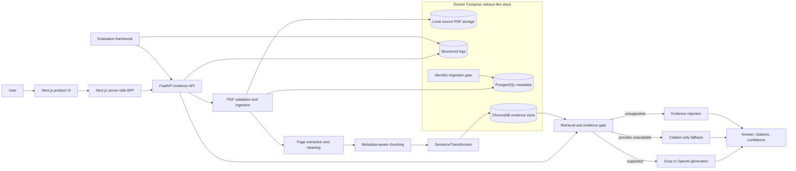

# PolicyGPT Enterprise

## Intelligence you can trace.

PolicyGPT Enterprise is a production-style evidence intelligence and policy RAG system for HR, SOP, compliance, and governance documents. It turns source PDFs into durable, searchable evidence and answers only when the retrieved material supports the question.

This repository is a portfolio engineering system, not a finished enterprise SaaS or a cloud-production claim. Its focus is the difficult space between a working RAG prototype and an operable product: document identity, provenance, calibrated confidence, controlled failure, evaluation, and release-like deployment.

## The problem

Policy answers are consequential. A fluent response without provenance is difficult to review, and a generic “upload a PDF and chat” workflow usually leaves important questions unanswered:

- Is this the same document that was indexed earlier?
- Which page and section support the answer?
- Was the evidence strong enough to permit generation?
- What happens when the question is outside the document?
- Can retrieval still work when the answer provider is unavailable?
- Can operators distinguish a live process from a ready deployment?

PolicyGPT makes those concerns part of the product contract.

## Why this is more than a PDF chatbot

| Concern | PolicyGPT design |
| --- | --- |
| Document identity | PostgreSQL lifecycle metadata and SHA-256 duplicate prevention |
| Evidence | Metadata-aware chunks, Chroma retrieval, and an explicit evidence gate |
| Provenance | Document, page, section, excerpt, and retrieval trace |
| Confidence | Calibrated answerability rather than treating similarity as probability |
| Unsupported questions | Generation is rejected when evidence cannot support the request |
| Provider failure | Citation-only evidence remains available without a provider key |
| Quality | A versioned 16-question evaluation dataset and repeatable scoring workflow |
| Operations | Request IDs, structured logs, liveness/readiness separation, migrations, and health-gated Compose startup |

## Product views

These are real repository screenshots; no generated dashboards or invented metrics are used.

### Document ingestion


### Citation-backed policy answer


### Unsupported-question handling


### Evidence diagnostics


The current Next.js product also includes Documents, Ask, Evaluation, and System views. New release screenshots should be captured from the real running application before replacing these committed images.

## Core workflow

1. Upload a PDF through the Next.js Documents product.
2. Validate the file, hash it, and prevent duplicate ingestion.
3. Store the source PDF under a generated key and track its lifecycle in PostgreSQL.
4. Extract and clean page-aware text, then create metadata-rich chunks.
5. Generate local SentenceTransformer embeddings and persist them in ChromaDB.
6. Ask a policy question through the server-side BFF.
7. Retrieve candidates, assess direct support, numeric consistency, and scope risk.
8. Generate only when evidence is answer-ready; otherwise return a controlled unsupported state.
9. Return an answer or provider-safe fallback with page citations and calibrated confidence.

## Architecture



The browser never receives `FASTAPI_URL`, database credentials, storage paths, or provider keys. The BFF normalizes upstream errors and disables caching for live product data.

## RAG and evidence design

The answer path is evidence-first:

```text
question
→ local query embedding
→ Chroma candidate retrieval
→ answerability and scope assessment
→ evidence gate
→ generation when supported
→ page-level citations + calibrated confidence
```

The confidence layer considers retrieval strength, margin, lexical coverage, numeric consistency, direct support, and external-authority risk. Retrieval similarity remains an engineering signal; it is not presented as a probability.

If evidence is insufficient, PolicyGPT does not ask a model to improvise. If evidence is sufficient but Groq/OpenAI cannot be used, it returns the citation evidence with a truthful provider-fallback state.

## Evaluation framework

The checked-in dataset contains 16 questions: 11 supported and 5 unsupported. It validates readiness decisions, fallback behavior, expected pages, keyword coverage, citations, confidence diagnostics, and provider behavior. Dataset metrics describe this benchmark only; they are not production accuracy or latency claims.

```bash
python eval/validate_dataset.py
bash scripts/evaluation/run-compose-eval.sh
```

The helper reads the configured Compose backend port, runs all 16 cases, writes
the JSON and CSV locally, and atomically installs both completed artifacts into
the existing backend evaluation-results volume. An optional non-negative
request delay may be passed as the first argument. The browser only reads the
latest artifact and never starts benchmark execution.

For native development, run `python eval/run_eval.py --help` and provide the
desired backend URL explicitly. The Next.js Evaluation product presents the
latest validated artifact across overview, cases, confidence, provider
reliability, and downloadable JSON/CSV views.

## Documents product

PostgreSQL is the source of truth for document identity, safe metadata, and lifecycle state. Source files and Chroma vectors remain separate persisted assets. The product supports:

- PDF upload with bounded validation
- atomic source storage
- SHA-256 duplicate prevention
- processing, ready, failed, and outage states
- document registry search, status filters, and pagination
- lifecycle and safe detail views

Deletion, reindexing, document-scoped Ask, and multi-document comparison are intentionally outside the current scope.

## Deployment architecture

The local release profile contains four services:

```text
PostgreSQL healthy
→ Alembic migration exits 0
→ FastAPI readiness succeeds
→ Next.js readiness succeeds
```

Backend and frontend images run as non-root users. Named volumes persist PostgreSQL, Chroma, source PDFs, logs, and evaluation artifacts across ordinary `docker compose down` / `up` cycles. Provider keys are optional and do not gate readiness.

Implemented production-engineering features include:

- separate `/api/v1/health` liveness and `/api/v1/ready` dependency readiness
- read-only PostgreSQL `SELECT 1` and Chroma collection accessibility checks
- validated or generated request IDs propagated through headers and logs
- one normalized HTTP completion log with latency and safe request metadata
- sanitized operational errors and conservative API/frontend security headers
- environment-driven CORS without wildcard credentials
- fail-fast configuration validation
- migration-gated Compose startup and read-only smoke testing
- comprehensive release verification with a documented Docker-build skip mode

See [deployment readiness](docs/deployment-readiness.md) and the [operations runbook](docs/operations-runbook.md).

## Technology stack

| Layer | Technologies |
| --- | --- |
| API | Python 3.13, FastAPI, Pydantic v2, structlog |
| Persistence | PostgreSQL 16, SQLAlchemy 2.x, psycopg, Alembic |
| RAG | SentenceTransformers, ChromaDB, PyMuPDF |
| Generation | Groq or OpenAI-compatible API with citation-only fallback |
| Product | Next.js 16, React 19, TypeScript, Tailwind CSS, shadcn/Base UI |
| Release | Docker Compose, non-root images, health checks, named volumes |
| Quality | pytest, Vitest, ESLint, production builds, custom RAG evaluation |

## Repository map

```text
app/                    FastAPI routes, services, schemas, database layer
alembic/                PostgreSQL schema migrations
frontend/               Next.js product and server-side BFF
eval/                   Evaluation dataset, runner, scoring, artifacts
scripts/compose/         Safe Compose smoke and import workflows
scripts/release/         Preflight and release verification
docs/                    Architecture, deployment, runbook, demo, case study
examples/                Sample HR policy PDF
screenshots/             Reviewed, real product captures
tests/                   Backend unit and API tests
```

## Quick start with Docker Compose

Prerequisites: Docker Compose v2, enough memory for the embedding-model image build, and free configured host ports.

```bash
cp .env.compose.example .env.compose
# Replace the example database password. Provider keys are optional.

scripts/release/preflight.sh
docker compose --env-file .env.compose build
docker compose --env-file .env.compose up -d
docker compose --env-file .env.compose ps -a
scripts/compose/smoke-test.sh
```

Open the product at `http://localhost:<FRONTEND_HOST_PORT>` and API documentation at `http://localhost:<BACKEND_HOST_PORT>/docs`. Defaults are 3000 and 8000, but the scripts read the actual env file.

Stop safely while preserving data:

```bash
docker compose --env-file .env.compose down
```

Do not add `-v` unless permanent deletion of every Compose-managed data volume is explicitly intended.

## Native development

Backend:

```bash
python3.13 -m venv .venv
source .venv/bin/activate
pip install -r requirements.txt -r requirements-dev.txt
cp .env.example .env
alembic upgrade head
python -m uvicorn app.api.main:app --reload
```

Frontend:

```bash
cd frontend
npm ci
cp .env.local.example .env.local
npm run dev
```

`FASTAPI_URL` is server-only. Variables prefixed `NEXT_PUBLIC_` are the only values intended for browser bundles.

## API overview

| Method and path | Purpose |
| --- | --- |
| `GET /api/v1/health` | Lightweight process liveness |
| `GET /api/v1/ready` | PostgreSQL and Chroma deployment readiness |
| `POST /api/v1/documents/upload` | Validate and synchronously ingest one PDF |
| `GET /api/v1/documents` | Paginated document registry |
| `GET /api/v1/documents/{id}` | Safe document details |
| `POST /api/v1/documents/evidence` | Retrieve and assess evidence |
| `POST /api/v1/documents/ask` | Evidence-gated answer or fallback |
| `GET /api/v1/evaluations/latest` | Latest validated evaluation artifact |

## Testing and release validation

Verified release baseline after this hardening step:

- 229 backend tests
- 112 frontend tests
- 16-question dataset validation
- frontend lint and production build
- Compose configuration and four-service health verification

Run native checks:

```bash
source .venv/bin/activate
python -m pytest -q tests
python eval/validate_dataset.py

cd frontend
npm run lint
npm run test
npm run build
```

Run the complete release verifier from the repository root:

```bash
scripts/release/verify.sh
```

For a fast native pass that leaves the image build as a manual gate:

```bash
scripts/release/verify.sh --skip-docker-build
```

## Security and privacy boundaries

The application validates PDFs, constrains CORS, disables the Next.js powered-by header, adds conservative response headers, avoids request-body logging, and never returns connection strings, credentials, internal service names, stack traces, source paths, chunks, or embeddings from operational endpoints.

This is not a complete security model. Authentication, authorization, tenant isolation, malware scanning, managed secrets, TLS termination, formal retention controls, security review, and compliance certification are not implemented.

## Decisions and tradeoffs

- Synchronous ingestion keeps the lifecycle easy to inspect but is not suitable for high-volume uploads.
- Embedded Chroma is simple and persistent for a single backend instance but is not a multi-replica vector service.
- Local source storage demonstrates ownership and recovery concerns without claiming object-storage durability.
- Provider-independent readiness protects evidence workflows from optional generation outages.
- Conservative unsupported behavior favors reviewability over answer coverage.
- Docker Compose provides release-like local orchestration, not cloud production infrastructure.

## Current limitations and roadmap

Current limitations include no authentication/RBAC, no multi-tenancy, no document deletion or reindexing, no background workers, no cloud backups, no distributed tracing infrastructure, and no hosted monitoring.

Reasonable next steps are authenticated tenant boundaries, asynchronous ingestion, object storage with malware scanning, managed PostgreSQL and backups, distributed vector infrastructure, TLS, secrets management, telemetry, and deliberate cloud deployment automation.

## Portfolio summary

PolicyGPT demonstrates end-to-end RAG engineering beyond prompt assembly: durable data modeling, evidence and confidence design, provider resilience, evaluation, product UX, API contracts, operational hardening, and release-like deployment. The [portfolio case study](docs/portfolio-case-study.md) explains the engineering decisions; the [demo guide](docs/demo-guide.md) provides 90-second, 3-minute, and 7-minute walkthroughs.
